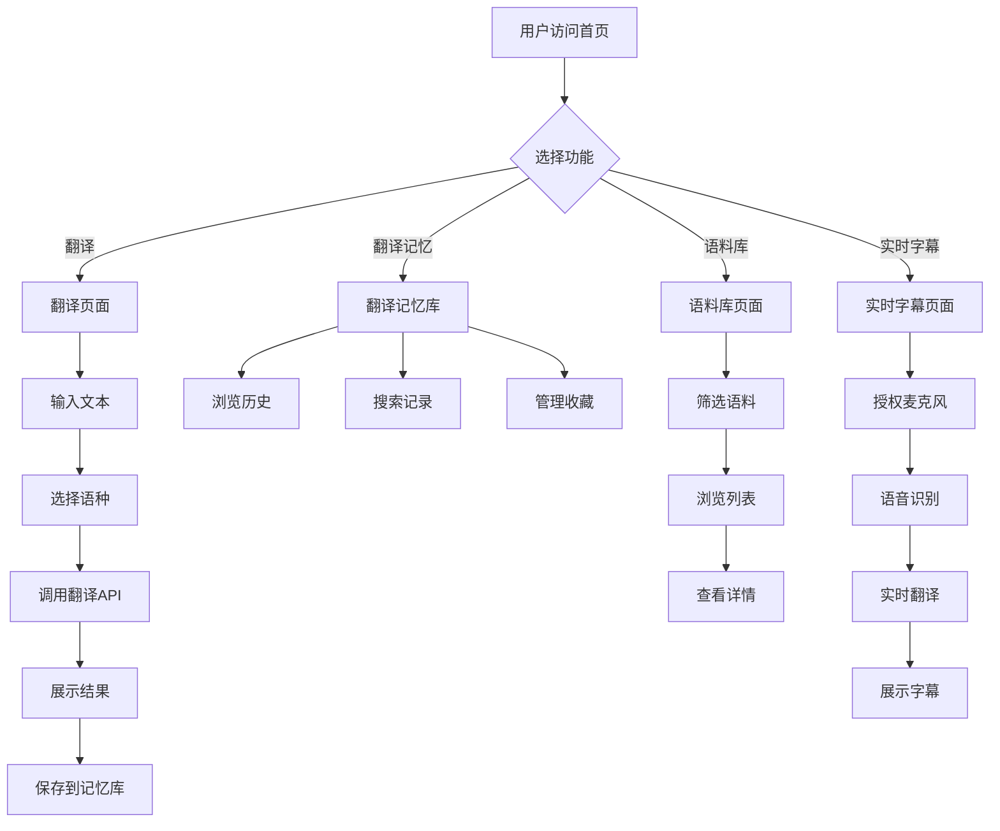

## 1. Product Overview
一款面向语言学习者的网页版翻译系统，提供多语种互译、翻译记忆库、语料库和实时字幕功能，帮助用户获得准确的对照翻译。

- **主要用途**: 提供高质量的多语种翻译服务，支持翻译记忆、语料积累和实时字幕
- **目标用户**: 语言学习者、翻译从业者、需要跨语言沟通的人群
- **市场价值**: 为用户提供准确、便捷的翻译体验，帮助用户高效学习和使用外语

## 2. Core Features

### 2.1 User Roles
| Role | Registration Method | Core Permissions |
|------|---------------------|------------------|
| Normal User | Email registration | 使用翻译功能、创建翻译记忆、浏览语料库 |
| Admin | Manual setup | 管理语料库、审核翻译记忆 |

### 2.2 Feature Module
1. **首页**: 快速翻译入口、热门语种、功能导航
2. **翻译页面**: 文本翻译、语种选择、翻译结果展示、对照视图
3. **翻译记忆库**: 个人翻译历史、收藏管理、记忆检索
4. **语料库**: 语料浏览、分类筛选、例句展示、搜索功能
5. **实时字幕**: 麦克风输入、实时语音转文字、翻译输出

### 2.3 Page Details
| Page Name | Module Name | Feature description |
|-----------|-------------|---------------------|
| 首页 | Hero section | 品牌展示、快速翻译入口、功能卡片导航 |
| 首页 | Language selector | 热门语种快捷选择 |
| 翻译页面 | Text input | 支持多种输入方式、字数统计 |
| 翻译页面 | Language picker | 源语言和目标语言选择 |
| 翻译页面 | Translation result | 翻译结果展示、对照视图切换 |
| 翻译页面 | Action buttons | 复制、发音、收藏功能 |
| 翻译记忆库 | History list | 翻译历史记录、分页浏览 |
| 翻译记忆库 | Favorites | 收藏的翻译条目管理 |
| 翻译记忆库 | Search | 关键词检索翻译记录 |
| 语料库 | Corpus list | 语料分类展示、分页浏览 |
| 语料库 | Filter | 语种、分类筛选 |
| 语料库 | Detail view | 例句详情、翻译对照 |
| 实时字幕 | Audio input | 麦克风权限获取、语音识别 |
| 实时字幕 | Subtitle display | 实时字幕展示、翻译输出 |
| 实时字幕 | Settings | 语言选择、字幕样式设置 |

## 3. Core Process

### 3.1 Translation Process
用户在首页或翻译页面输入文本，选择源语言和目标语言，点击翻译按钮，系统调用翻译API获取结果，展示翻译结果并保存到翻译记忆库。

### 3.2 Translation Memory Process
用户可以查看历史翻译记录，对重要的翻译进行收藏，通过关键词搜索快速查找之前的翻译结果。

### 3.3 Corpus Browsing Process
用户浏览语料库，通过语种和分类筛选找到感兴趣的例句，查看原文和翻译对照。

### 3.4 Real-time Subtitle Process
用户进入实时字幕页面，授权麦克风权限，系统实时识别语音并翻译成目标语言，以字幕形式展示。

### 3.5 Flowchart

## 4. User Interface Design

### 4.1 Design Style
- **主色调**: 深蓝色系 (#1e3a5f)，传达专业、可靠的形象
- **辅助色**: 青色 (#00d4ff)，用于强调和交互元素
- **按钮风格**: 圆角矩形，主按钮深蓝色背景白色文字，次按钮白色背景蓝色边框
- **字体**: 使用 Inter 字体，清晰易读
- **布局风格**: 卡片式布局，简洁现代
- **图标风格**: 使用 lucide-react 图标库，线性风格

### 4.2 Page Design Overview
| Page Name | Module Name | UI Elements |
|-----------|-------------|-------------|
| 首页 | Hero section | 大标题、副标题、快速翻译输入框、CTA按钮、背景渐变动画 |
| 首页 | Feature cards | 四个功能卡片（翻译、记忆库、语料库、实时字幕），悬停放大效果 |
| 翻译页面 | Header | Logo、导航、用户头像 |
| 翻译页面 | Input area | 左侧源文本输入框，支持换行，右下角字数统计 |
| 翻译页面 | Output area | 右侧翻译结果展示，支持对照视图切换 |
| 翻译页面 | Language selector | 源语言和目标语言下拉选择器，支持常用语种快捷切换 |
| 翻译记忆库 | Search bar | 顶部搜索框，支持关键词搜索 |
| 翻译记忆库 | Filter tabs | 全部、收藏、最近标签切换 |
| 翻译记忆库 | History items | 卡片式展示，包含原文、翻译、时间戳、操作按钮 |
| 语料库 | Category filter | 侧边栏分类导航 |
| 语料库 | Corpus list | 列表式展示，包含原文、翻译、来源 |
| 语料库 | Detail modal | 弹窗展示详细例句和背景信息 |
| 实时字幕 | Video area | 视频/摄像头预览区域（可选） |
| 实时字幕 | Subtitle display | 大字号字幕展示区域，支持实时滚动 |
| 实时字幕 | Controls | 开始/停止按钮、语言选择、字幕样式设置 |

### 4.3 Responsiveness
- **桌面端**: 完整功能展示，多栏布局
- **平板端**: 自适应布局，减少侧边栏
- **移动端**: 单列布局，底部导航，输入区域优化

### 4.4 Accessibility
- 支持键盘导航
- 提供清晰的焦点状态
- 使用语义化HTML
- 支持屏幕阅读器

## 5. Non-functional Requirements
- **性能**: 翻译响应时间 < 2秒
- **可用性**: 支持主流浏览器（Chrome、Firefox、Safari、Edge）
- **安全性**: 用户数据加密存储，API密钥安全管理
- **扩展性**: 支持新增语种和功能模块