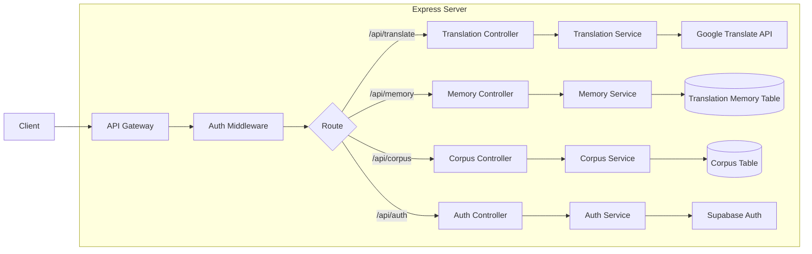
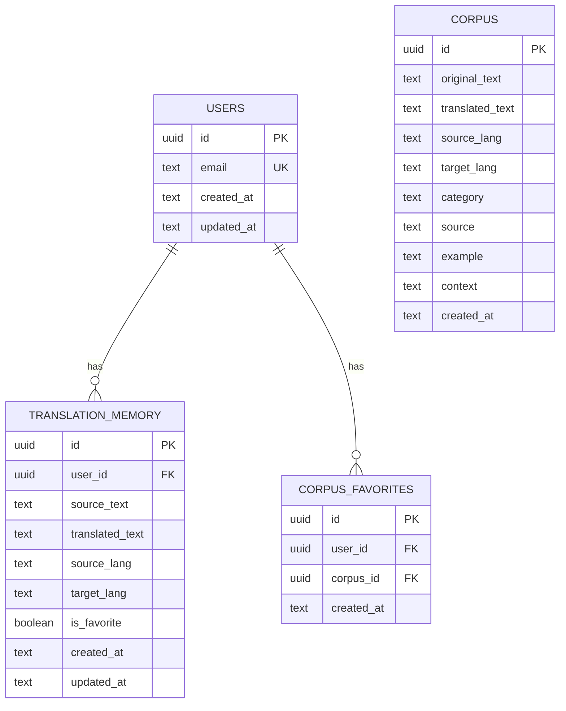

## 1. Architecture Design

```mermaid
layeredGraph LR
    subgraph Frontend
        A[React Components] --> B[Zustand State Management]
        B --> C[API Service]
    end
    
    subgraph Backend
        D[Express API Server] --> E[Translation Service]
        D --> F[Auth Service]
    end
    
    subgraph Data Layer
        G[(Supabase PostgreSQL)]
        H[(Translation Memory)]
        I[(Corpus Database)]
    end
    
    subgraph External Services
        J[Translation API]
        K[Speech Recognition API]
    end
    
    C --> D
    D --> G
    D --> H
    D --> I
    E --> J
    F --> K
```

## 2. Technology Description

- **Frontend**: React@18 + TypeScript + TailwindCSS@3 + Vite
- **Initialization Tool**: vite-init (react-ts template)
- **State Management**: Zustand
- **Routing**: React Router DOM
- **UI Components**: Lucide React icons
- **Backend**: Express@4 + TypeScript
- **Database**: Supabase (PostgreSQL)
- **Authentication**: Supabase Auth
- **Translation API**: Google Translate API (via google-translate-api library)
- **Speech Recognition**: Web Speech API (browser built-in)

## 3. Route Definitions

| Route | Purpose |
|-------|---------|
| / | 首页，快速翻译入口 |
| /translate | 翻译页面，文本翻译功能 |
| /memory | 翻译记忆库，历史记录和收藏 |
| /corpus | 语料库，例句浏览 |
| /subtitle | 实时字幕，语音翻译 |
| /login | 登录页面 |
| /register | 注册页面 |

## 4. API Definitions

### 4.1 Translation API

**POST /api/translate**
- Description: 翻译文本
- Request Body:
```typescript
{
  text: string;           // 待翻译文本
  sourceLang: string;     // 源语言代码 (e.g., 'en', 'zh')
  targetLang: string;     // 目标语言代码
}
```
- Response:
```typescript
{
  success: boolean;
  translation: string;    // 翻译结果
  sourceLang: string;
  targetLang: string;
}
```

### 4.2 Translation Memory API

**GET /api/memory**
- Description: 获取翻译记忆列表
- Query Params:
```typescript
{
  page?: number;          // 页码，默认1
  limit?: number;         // 每页数量，默认20
  search?: string;        // 搜索关键词
  favorite?: boolean;     // 是否只显示收藏
}
```
- Response:
```typescript
{
  success: boolean;
  data: Array<{
    id: string;
    sourceText: string;
    translatedText: string;
    sourceLang: string;
    targetLang: string;
    isFavorite: boolean;
    createdAt: string;
    updatedAt: string;
  }>;
  total: number;
  page: number;
}
```

**POST /api/memory**
- Description: 保存翻译记忆
- Request Body:
```typescript
{
  sourceText: string;
  translatedText: string;
  sourceLang: string;
  targetLang: string;
}
```
- Response:
```typescript
{
  success: boolean;
  id: string;
}
```

**PUT /api/memory/:id/favorite**
- Description: 切换收藏状态
- Response:
```typescript
{
  success: boolean;
  isFavorite: boolean;
}
```

**DELETE /api/memory/:id**
- Description: 删除翻译记忆
- Response:
```typescript
{
  success: boolean;
}
```

### 4.3 Corpus API

**GET /api/corpus**
- Description: 获取语料列表
- Query Params:
```typescript
{
  page?: number;          // 页码，默认1
  limit?: number;         // 每页数量，默认20
  lang?: string;          // 语种筛选
  category?: string;      // 分类筛选
  search?: string;        // 搜索关键词
}
```
- Response:
```typescript
{
  success: boolean;
  data: Array<{
    id: string;
    originalText: string;
    translatedText: string;
    sourceLang: string;
    targetLang: string;
    category: string;
    source: string;
    example?: string;
  }>;
  total: number;
  page: number;
}
```

**GET /api/corpus/:id**
- Description: 获取语料详情
- Response:
```typescript
{
  success: boolean;
  data: {
    id: string;
    originalText: string;
    translatedText: string;
    sourceLang: string;
    targetLang: string;
    category: string;
    source: string;
    example: string;
    context: string;
  };
}
```

### 4.4 Auth API

**POST /api/auth/login**
- Description: 用户登录
- Request Body:
```typescript
{
  email: string;
  password: string;
}
```
- Response:
```typescript
{
  success: boolean;
  user: {
    id: string;
    email: string;
  };
  token: string;
}
```

**POST /api/auth/register**
- Description: 用户注册
- Request Body:
```typescript
{
  email: string;
  password: string;
}
```
- Response:
```typescript
{
  success: boolean;
  user: {
    id: string;
    email: string;
  };
}
```

## 5. Server Architecture Diagram



## 6. Data Model

### 6.1 Data Model Definition



### 6.2 Data Definition Language

```sql
CREATE TABLE users (
    id UUID PRIMARY KEY DEFAULT gen_random_uuid(),
    email TEXT UNIQUE NOT NULL,
    created_at TIMESTAMP WITH TIME ZONE DEFAULT NOW(),
    updated_at TIMESTAMP WITH TIME ZONE DEFAULT NOW()
);

CREATE TABLE translation_memory (
    id UUID PRIMARY KEY DEFAULT gen_random_uuid(),
    user_id UUID REFERENCES users(id) ON DELETE CASCADE,
    source_text TEXT NOT NULL,
    translated_text TEXT NOT NULL,
    source_lang TEXT NOT NULL,
    target_lang TEXT NOT NULL,
    is_favorite BOOLEAN DEFAULT FALSE,
    created_at TIMESTAMP WITH TIME ZONE DEFAULT NOW(),
    updated_at TIMESTAMP WITH TIME ZONE DEFAULT NOW()
);

CREATE TABLE corpus (
    id UUID PRIMARY KEY DEFAULT gen_random_uuid(),
    original_text TEXT NOT NULL,
    translated_text TEXT NOT NULL,
    source_lang TEXT NOT NULL,
    target_lang TEXT NOT NULL,
    category TEXT NOT NULL,
    source TEXT,
    example TEXT,
    context TEXT,
    created_at TIMESTAMP WITH TIME ZONE DEFAULT NOW()
);

CREATE TABLE corpus_favorites (
    id UUID PRIMARY KEY DEFAULT gen_random_uuid(),
    user_id UUID REFERENCES users(id) ON DELETE CASCADE,
    corpus_id UUID REFERENCES corpus(id) ON DELETE CASCADE,
    created_at TIMESTAMP WITH TIME ZONE DEFAULT NOW()
);

CREATE INDEX idx_translation_memory_user_id ON translation_memory(user_id);
CREATE INDEX idx_translation_memory_is_favorite ON translation_memory(is_favorite);
CREATE INDEX idx_corpus_lang ON corpus(source_lang, target_lang);
CREATE INDEX idx_corpus_category ON corpus(category);
CREATE INDEX idx_corpus_favorites_user_id ON corpus_favorites(user_id);

GRANT SELECT ON corpus TO anon;
GRANT ALL PRIVILEGES ON translation_memory TO authenticated;
GRANT SELECT, INSERT, DELETE ON corpus_favorites TO authenticated;
```

## 7. Project Structure

```
trans A/
├── .trae/
│   └── documents/
│       ├── prd.md
│       └── technical-architecture.md
├── src/
│   ├── components/
│   │   ├── Header.tsx
│   │   ├── Footer.tsx
│   │   ├── LanguageSelector.tsx
│   │   ├── TranslationCard.tsx
│   │   ├── MemoryCard.tsx
│   │   ├── CorpusCard.tsx
│   │   └── SubtitleDisplay.tsx
│   ├── pages/
│   │   ├── Home.tsx
│   │   ├── Translate.tsx
│   │   ├── Memory.tsx
│   │   ├── Corpus.tsx
│   │   ├── Subtitle.tsx
│   │   ├── Login.tsx
│   │   └── Register.tsx
│   ├── hooks/
│   │   ├── useTranslation.ts
│   │   ├── useMemory.ts
│   │   └── useSpeechRecognition.ts
│   ├── stores/
│   │   └── store.ts
│   ├── utils/
│   │   ├── api.ts
│   │   └── languages.ts
│   ├── App.tsx
│   ├── main.tsx
│   └── index.css
├── api/
│   ├── src/
│   │   ├── controllers/
│   │   │   ├── translation.ts
│   │   │   ├── memory.ts
│   │   │   ├── corpus.ts
│   │   │   └── auth.ts
│   │   ├── services/
│   │   │   ├── translation.ts
│   │   │   ├── memory.ts
│   │   │   ├── corpus.ts
│   │   │   └── auth.ts
│   │   ├── middleware/
│   │   │   └── auth.ts
│   │   ├── routes/
│   │   │   ├── translation.ts
│   │   │   ├── memory.ts
│   │   │   ├── corpus.ts
│   │   │   └── auth.ts
│   │   ├── database/
│   │   │   └── supabase.ts
│   │   ├── app.ts
│   │   └── server.ts
│   └── package.json
├── package.json
├── tsconfig.json
├── vite.config.ts
├── tailwind.config.js
└── postcss.config.js
```

## 8. Key Implementation Details

### 8.1 Translation Service
- 使用 google-translate-api 库调用 Google 翻译
- 支持自动检测源语言
- 处理API调用失败的重试逻辑

### 8.2 Speech Recognition
- 使用浏览器原生 Web Speech API
- 支持多种语言的语音识别
- 实时字幕更新，支持滚动显示

### 8.3 Authentication
- 使用 Supabase Auth 处理用户认证
- 使用 JWT token 进行API请求验证
- 前端使用 zustand 存储用户状态

### 8.4 Responsive Design
- 使用 TailwindCSS 的响应式工具类
- 桌面端使用多栏布局，移动端使用单列布局
- 底部导航在移动端显示

### 8.5 Performance Optimization
- 使用 React.memo 和 useMemo 优化组件渲染
- 分页加载翻译记忆和语料数据
- 翻译结果缓存